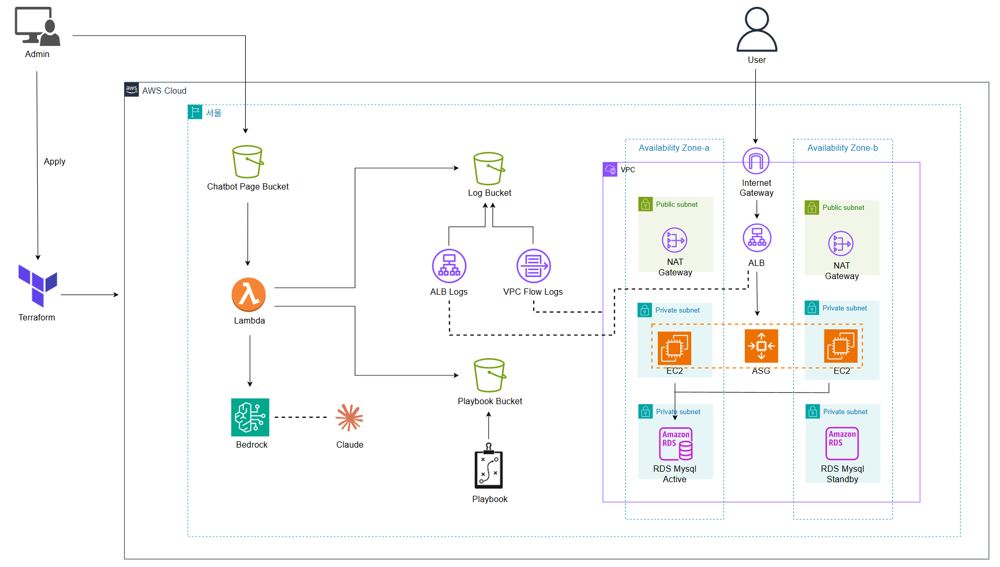

# 아키텍처


# AWS Log Chatbot (Terraform)
- 자연어 질의로 ALB/VPC Flow 로그를 요약, 결론/근거/원인/조치 제시
- Lambda + Bedrock, S3(Log/Playbook/Page), ALB/ASG/EC2, RDS, VPC
- IaC: Terraform

# 선행조건
- AWS 콘솔 접속 후, Amazon Bedrock -> Configure and learn -> 모델 액세스 -> Claude 3.5 Sonnet을 액세스 요청해야합니다.(사용 리전 지정 - 본 프로젝트는 서울 기준)

# 사용방법
- terraform.tfvars.example파일을 자신에 맞게 수정 후, terraform.tfvars로 변경하세요.

# Windows (PowerShell)
```powershell
# 1) 레포지토리 클론
git clone https://github.com/woongaga/aws-log-chatbot.git
cd aws-log-chatbot

# 2) 변수 파일 템플릿 복사 후 값 채우기
Copy-Item .\terraform.tfvars.example .\terraform.tfvars
# 메모장 등으로 terraform.tfvars 열어 S3 버킷명, DB 비밀번호, CORS Origin 등을 입력

# 3) AWS CLI 프로파일 설정(최초 1회)
aws configure --profile default
```

# Linux
```bash
# 1) 레포지토리 클론
git clone https://github.com/woongaga/aws-log-chatbot.git
cd aws-log-chatbot

# 2) 변수 파일 템플릿 복사 후 값 채우기
cp terraform.tfvars.example terraform.tfvars
# 편집기로 terraform.tfvars 수정(S3, DB, CORS 등)

# 3) AWS CLI 프로파일 설정(최초 1회)
aws configure --profile default
```

# 배포 및 삭제
```bash
terraform init
terraform fmt -recursive
terraform validate
terraform plan
terraform apply

terraform destroy
```
# 검증
- 브라우저에서 S3 Website URL 접속 → 버튼(“오늘 비정상 로그 있어?” 등)으로 질의 테스트
- 의도적 4xx/5xx 로그 생성 팁
  - 404: `http://<ALB-DNS>/no-such-page` 요청
  - 504: RDS 보안 그룹에서 EC2→RDS 포트를 잠시 막고 `http://<ALB-DNS>` 열기

# 유의할 점
- NAT/ALB/RDS가 포함되어 시간 단위 과금 발생
- 현재 데모 버전으로 기능 검증(PoC)과 재현성을 우선해서 퍼블릭 S3 웹사이트 + Function URL로 단순화
- 실제 운영 단계에서는 접근 통제를 위해 CloudFront + OAC, Cognito, API Gateway 등으로 접근 제어 강화 필요
